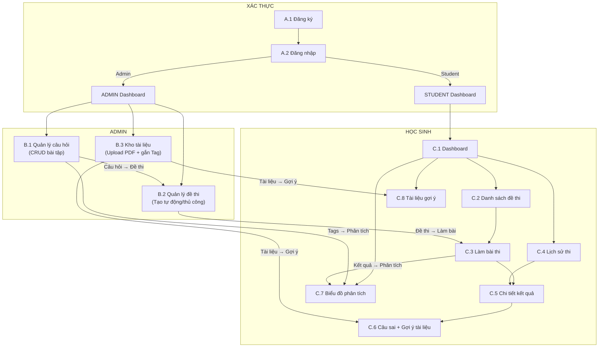

# KỊCH BẢN CHI TIẾT - HỆ THỐNG QUẢN LÝ ÔN LUYỆN TIẾNG ANH THPT

---

## MỤC LỤC

- [PHẦN A: CHỨC NĂNG CHUNG (XÁC THỰC)](#phần-a-chức-năng-chung-xác-thực)
  - [A.1 Đăng ký tài khoản Học sinh](#a1-đăng-ký-tài-khoản-học-sinh)
  - [A.2 Đăng nhập hệ thống](#a2-đăng-nhập-hệ-thống)
  - [A.3 Đăng xuất](#a3-đăng-xuất)
- [PHẦN B: CHỨC NĂNG CỦA QUẢN TRỊ VIÊN (ADMIN)](#phần-b-chức-năng-của-quản-trị-viên-admin)
  - [B.1 Quản lý câu hỏi (Bài tập)](#b1-quản-lý-câu-hỏi-bài-tập)
  - [B.2 Quản lý đề thi](#b2-quản-lý-đề-thi)
  - [B.3 Quản lý kho tài liệu ôn tập](#b3-quản-lý-kho-tài-liệu-ôn-tập)
- [PHẦN C: CHỨC NĂNG CỦA HỌC SINH](#phần-c-chức-năng-của-học-sinh)
  - [C.1 Trang chủ Dashboard](#c1-trang-chủ-dashboard)
  - [C.2 Xem danh sách đề thi](#c2-xem-danh-sách-đề-thi)
  - [C.3 Làm bài thi](#c3-làm-bài-thi)
  - [C.4 Xem lịch sử thi](#c4-xem-lịch-sử-thi)
  - [C.5 Xem chi tiết kết quả thi](#c5-xem-chi-tiết-kết-quả-thi)
  - [C.6 Xem tổng hợp câu sai/chưa chọn kèm gợi ý tài liệu](#c6-xem-tổng-hợp-câu-saichưa-chọn-kèm-gợi-ý-tài-liệu)
  - [C.7 Phân tích năng lực học tập (Biểu đồ)](#c7-phân-tích-năng-lực-học-tập-biểu-đồ)
  - [C.8 Tài liệu gợi ý ôn tập cá nhân hóa](#c8-tài-liệu-gợi-ý-ôn-tập-cá-nhân-hóa)
- [PHẦN D: NGOẠI LỆ CHUNG](#phần-d-ngoại-lệ-chung)
- [PHẦN E: LIÊN KẾT GIỮA CÁC KỊCH BẢN](#phần-e-liên-kết-giữa-các-kịch-bản)

---

## PHẦN A: CHỨC NĂNG CHUNG (XÁC THỰC)

### A.1 Đăng Ký Tài Khoản Học Sinh

**Use case:** Người dùng mới tạo tài khoản Học sinh để truy cập hệ thống

**Actor:** Người dùng chưa có tài khoản

**Tiền điều kiện:**
- Người dùng chưa có tài khoản trong hệ thống
- Người dùng truy cập trang `/register`

**Hậu điều kiện:**
- Tài khoản mới được tạo trong bảng `Users` với `RoleID = 2` (Student)
- Một bản ghi mới được tạo trong bảng `Students` (kế thừa ISA)
- Mật khẩu được mã hóa bằng `bcryptjs` trước khi lưu
- Người dùng được chuyển hướng đến trang đăng nhập

**Kịch bản chính:**

| Bước | Diễn tả | Actor | Hệ thống |
|------|---------|-------|----------|
| 1 | Người dùng truy cập trang `/register` | Người dùng | Hiển thị form đăng ký với giao diện 2 cột: bên trái banner màu emerald (✏️ icon), bên phải form đăng ký |
| 2 | Người dùng nhập Họ và tên (VD: "Nguyễn Văn A") | Người dùng | Trường input được cập nhật |
| 3 | Người dùng nhập Email (VD: "student@example.com") | Người dùng | Trường input email được cập nhật |
| 4 | Người dùng nhập Mật khẩu (tối thiểu 6 ký tự) | Người dùng | Trường mật khẩu được cập nhật, có nút 👁 hiển thị/ẩn mật khẩu |
| 5 | Người dùng nhập lại mật khẩu xác nhận | Người dùng | Trường xác nhận mật khẩu được cập nhật |
| 6 | Người dùng click nút "Đăng ký tài khoản" | Người dùng | Hệ thống validate dữ liệu phía client |
| 7 | - | Hệ thống | Kiểm tra: mật khẩu >= 6 ký tự, mật khẩu xác nhận khớp |
| 8 | - | Hệ thống | Gửi `POST /api/auth/register` với `{ fullName, email, password }` |
| 9 | - | Backend | Kiểm tra email chưa tồn tại trong bảng `Users` |
| 10 | - | Backend | Mã hóa mật khẩu bằng `bcrypt.hash(password, 10)` |
| 11 | - | Backend | INSERT vào `Users` (RoleID = 2) → lấy `UserID` mới |
| 12 | - | Backend | INSERT vào `Students` (StudentID = UserID mới) |
| 13 | - | Backend | Trả về `201: "Đăng ký thành công tài khoản học sinh!"` |
| 14 | Người dùng thấy thông báo thành công (popup xanh) | Người dùng | Sau 2 giây tự động chuyển hướng đến trang `/login` |

**Ngoại lệ:**

| Mã | Điều kiện | Hệ thống | Kết quả |
|----|-----------|----------|---------|
| A.1.1 | Mật khẩu dưới 6 ký tự | Hiển thị cảnh báo đỏ: "Mật khẩu phải có ít nhất 6 ký tự!" | Form không submit |
| A.1.2 | Mật khẩu xác nhận không khớp | Hiển thị cảnh báo đỏ: "Mật khẩu xác nhận không khớp!" | Form không submit |
| A.1.3 | Email đã tồn tại trong hệ thống | Backend trả 400: "Email đã tồn tại!" → hiển thị cảnh báo đỏ | Form giữ nguyên dữ liệu |
| A.1.4 | Lỗi server khi đăng ký | Backend trả 500: "Lỗi đăng ký" | Hiển thị thông báo lỗi, form giữ nguyên |
| A.1.5 | Người dùng đã có tài khoản | Click link "Đăng nhập ngay" | Chuyển hướng đến `/login` |

---

### A.2 Đăng Nhập Hệ Thống

**Use case:** Người dùng đăng nhập vào hệ thống (Admin hoặc Học sinh)

**Actor:** Người dùng đã có tài khoản (Admin hoặc Học sinh)

**Tiền điều kiện:**
- Tài khoản tồn tại trong hệ thống
- Người dùng chưa đăng nhập (chưa có token)

**Hậu điều kiện:**
- JWT token (thời hạn 8 giờ) được lưu vào `localStorage`
- Thông tin user (UserID, FullName, Email, role) được lưu vào `localStorage`
- Điều hướng theo role: Admin → `/admin`, Student → `/dashboard`

**Kịch bản chính:**

| Bước | Diễn tả | Actor | Hệ thống |
|------|---------|-------|----------|
| 1 | Người dùng truy cập trang `/login` | Người dùng | Hiển thị form đăng nhập với giao diện 2 cột: bên trái banner màu indigo (📚 icon) với text "Luyện thi Tiếng Anh THPT Quốc Gia", bên phải form đăng nhập |
| 2 | Người dùng nhập Email | Người dùng | Trường email cập nhật |
| 3 | Người dùng nhập Mật khẩu | Người dùng | Trường mật khẩu cập nhật, có nút 👁 hiện/ẩn |
| 4 | Người dùng click nút "Vào hệ thống" | Người dùng | Nút hiển thị spinner "Đang đăng nhập..." |
| 5 | - | Hệ thống | Gửi `POST /api/auth/login` với `{ email, password }` |
| 6 | - | Backend | JOIN bảng `Users` với `Roles` để lấy `RoleName` |
| 7 | - | Backend | So sánh mật khẩu bằng `bcrypt.compare()` |
| 8 | - | Backend | Tạo JWT token chứa `{ userId, role }`, expiresIn: '8h' |
| 9 | - | Backend | Trả về `{ token, user: { UserID, FullName, Email, role } }` |
| 10 | - | Frontend | Lưu token và user vào `localStorage` |
| 11 | - | Frontend | Nếu role = "Admin" → navigate `/admin`; Nếu role khác → navigate `/dashboard` |

**Ngoại lệ:**

| Mã | Điều kiện | Hệ thống | Kết quả |
|----|-----------|----------|---------|
| A.2.1 | Email không tồn tại | Backend trả 404: "Email không tồn tại!" | Hiển thị cảnh báo đỏ |
| A.2.2 | Mật khẩu sai | Backend trả 400: "Mật khẩu sai!" | Hiển thị cảnh báo đỏ |
| A.2.3 | Lỗi server | Backend trả 500: "Lỗi đăng nhập" | Hiển thị thông báo lỗi |
| A.2.4 | Chưa có tài khoản | Click link "Đăng ký ngay" | Chuyển hướng đến `/register` |

---

### A.3 Đăng Xuất

**Use case:** Người dùng đăng xuất khỏi hệ thống

**Actor:** Người dùng đã đăng nhập (Admin hoặc Học sinh)

**Kịch bản chính:**

| Bước | Diễn tả | Actor | Hệ thống |
|------|---------|-------|----------|
| 1 | Người dùng click nút "Đăng xuất" trên header/sidebar | Người dùng | - |
| 2 | - | Hệ thống | `localStorage.clear()` — xóa token và user |
| 3 | - | Hệ thống | Navigate đến `/login` |

---

## PHẦN B: CHỨC NĂNG CỦA QUẢN TRỊ VIÊN (ADMIN)

> **Phân quyền:** Tất cả route Admin được bảo vệ bởi `PrivateRoute` kiểm tra `role === "Admin"`. Nếu người dùng không có quyền Admin sẽ bị chuyển hướng về `/dashboard`.
>
> **Giao diện chung:** Admin layout gồm sidebar cố định bên trái (nền indigo-900) chứa 3 menu chính: Quản lý câu hỏi, Quản lý đề thi, Kho tài liệu. Phần nội dung chính hiển thị bên phải.

---

### B.1 Quản Lý Câu Hỏi (Bài Tập)

> **Cấu trúc dữ liệu đặc biệt:** Hệ thống sử dụng cấu trúc câu hỏi cha-con (Parent-Child). Mỗi "bài tập" gồm:
> - **Câu cha (Parent/Passage):** Chứa đề bài (prompt) + đoạn văn (passage) dưới dạng JSON `{ prompt, passage }`, có `IsPassage = 1`
> - **Câu con (Children):** Các câu hỏi trắc nghiệm con, mỗi câu có 4 đáp án (A, B, C, D) với 1 đáp án đúng
> - **Số lượng câu con phụ thuộc vào loại bài tập:**
>   - `Leaflet`: 6 câu con
>   - `Ordering`: 5 câu con (không yêu cầu passage)
>   - `Context_Filling`: 5 câu con
>   - `Reading_8`: 8 câu con
>   - `Reading_10`: 10 câu con

#### B.1.1 Thêm Bài Tập Mới

**Use case:** Admin thêm một bài tập mới vào ngân hàng câu hỏi

**Actor:** Quản trị viên (Admin)

**Tiền điều kiện:**
- Admin đã đăng nhập thành công, có role = "Admin"
- Hệ thống có ít nhất 1 Tag kiến thức đã được định nghĩa (bảng Tags liên kết Skills)

**Hậu điều kiện:**
- Câu hỏi cha (Passage) được lưu vào bảng `Questions` với `IsPassage = 1`
- Các câu hỏi con được lưu với `ParentID` trỏ về câu cha
- Mỗi câu con có 4 bản ghi trong bảng `Answers` (1 đúng, 3 sai, kèm Explanation)
- Tags được liên kết qua bảng `Question_Tags` cho cả câu cha và câu con
- Toàn bộ thao tác được thực hiện trong 1 SQL Transaction (rollback nếu lỗi)

**Kịch bản chính:**

| Bước | Diễn tả | Actor | Hệ thống |
|------|---------|-------|----------|
| 1 | Admin click menu "Quản lý câu hỏi" trên sidebar | Admin | Hiển thị trang `QuestionManager` với danh sách bài tập hiện có |
| 2 | Admin click nút "Thêm bài tập mới" | Admin | Hiển thị form `QuestionForm` trong chế độ tạo mới |
| 3 | Admin chọn **Loại bài tập** từ dropdown (Leaflet / Ordering / Context_Filling / Reading_8 / Reading_10) | Admin | Hệ thống tự động điều chỉnh số lượng câu hỏi con yêu cầu và hiển thị prompt mặc định tương ứng |
| 4 | Admin nhập **Đề bài (Prompt)** — nội dung yêu cầu cho đoạn văn | Admin | Textarea prompt được cập nhật |
| 5 | Admin nhập **Đoạn văn (Passage)** — nội dung bài đọc (bắt buộc trừ loại Ordering) | Admin | Textarea passage được cập nhật, hỗ trợ placeholder `[BLANK]` cho loại Context_Filling |
| 6 | Admin chọn **Mức độ khó** từ dropdown (Dễ / Trung bình / Khó) | Admin | Dropdown level được cập nhật |
| 7 | Admin chọn **Tags kiến thức** cho bài tập (multi-select checkbox) | Admin | Hệ thống hiển thị danh sách Tags từ API `GET /api/tags`, nhóm theo Skill (Ngữ pháp, Từ vựng, Đọc hiểu...) |
| 8 | Admin điền **từng câu hỏi con** (N câu tùy loại): Nội dung câu hỏi, 4 đáp án (A, B, C, D), chọn đáp án đúng (radio button), nhập giải thích (Explanation) cho đáp án đúng | Admin | Form hiển thị N panel câu hỏi con, mỗi panel có: textarea nội dung, 4 input đáp án, radio chọn đáp án đúng, textarea giải thích |
| 9 | Admin chọn **Tags** riêng cho từng câu hỏi con (multi-select) | Admin | Tags được gán riêng cho mỗi câu con qua bảng `Question_Tags` |
| 10 | Admin click nút **"Lưu bài tập"** | Admin | Hệ thống validate toàn bộ dữ liệu |
| 11 | - | Hệ thống | **Validate:** Loại bài tập hợp lệ? Prompt không trống? Passage không trống (trừ Ordering)? Đủ N câu con? Mỗi câu con có 4 đáp án, đúng 1 đáp án đúng? Mỗi câu con có ít nhất 1 tag? |
| 12 | - | Backend | Mở SQL Transaction → INSERT câu cha → INSERT tags câu cha → INSERT N câu con (mỗi câu: INSERT câu con → INSERT tags câu con → INSERT 4 đáp án) → Commit |
| 13 | - | Backend | Trả về `201: { message: "Thêm bài tập thành công!", questionId }` |
| 14 | Admin nhìn thấy thông báo thành công | Admin | Form reset, quay lại danh sách, bài tập mới xuất hiện ở đầu danh sách |

**Ngoại lệ:**

| Mã | Điều kiện | Hệ thống | Kết quả |
|----|-----------|----------|---------|
| B.1.1.1 | Loại bài tập không hợp lệ | Backend trả 400: "Loại câu hỏi không hợp lệ" | Form không submit |
| B.1.1.2 | Prompt trống | Backend trả 400: "Vui lòng nhập đề bài" | Form không submit |
| B.1.1.3 | Passage trống (trừ Ordering) | Backend trả 400: "Đoạn văn là bắt buộc cho loại đề này" | Form không submit |
| B.1.1.4 | Số câu con không đúng | Backend trả 400: "Yêu cầu phải có đúng X câu hỏi cho loại Y" | Form không submit |
| B.1.1.5 | Một câu con thiếu đáp án hoặc không đủ 4 đáp án | Backend trả 400: "Mỗi câu hỏi phải có đủ 4 đáp án" | Form không submit |
| B.1.1.6 | Một câu con chọn đúng nhiều hơn 1 đáp án hoặc không chọn | Backend trả 400: "Mỗi câu hỏi cần đúng 1 đáp án đúng" | Form không submit |
| B.1.1.7 | Một câu con chưa gán tag | Backend trả 400: "Câu X chưa được gán tag. Vui lòng chọn ít nhất 1 tag" | Form không submit |
| B.1.1.8 | Lỗi kết nối CSDL khi lưu | Backend trả 500 + tự động rollback Transaction | Form giữ nguyên dữ liệu, Admin thử lại |

---

#### B.1.2 Xem Danh Sách Bài Tập

**Use case:** Admin xem, tìm kiếm và lọc danh sách bài tập trong ngân hàng câu hỏi

**Actor:** Quản trị viên (Admin)

**Kịch bản chính:**

| Bước | Diễn tả | Actor | Hệ thống |
|------|---------|-------|----------|
| 1 | Admin truy cập menu "Quản lý câu hỏi" | Admin | Gọi API `GET /api/questions` → lấy danh sách câu cha (`ParentID IS NULL`) |
| 2 | Danh sách hiển thị với mỗi hàng: Nội dung tóm tắt (Prompt + Passage), Loại bài tập, Mức độ khó, Số câu con (ChildCount), Tags, Ngày tạo | Hệ thống | Hiển thị dạng bảng (`QuestionList`), sắp xếp theo `CreatedAt DESC` |
| 3 | Admin nhập từ khóa tìm kiếm ở thanh tìm kiếm (VD: "pronunciation") | Admin | Tìm kiếm nội dung câu cha và câu con chứa từ khóa (query parameter `q`) |
| 4 | Admin lọc theo **Loại bài tập** (dropdown: Leaflet / Ordering / Context_Filling / Reading_8 / Reading_10) | Admin | Bộ lọc `type` cập nhật, danh sách chỉ hiển thị loại đó |
| 5 | Admin lọc theo **Mức độ khó** (dropdown: Dễ / Trung bình / Khó) | Admin | Bộ lọc `level` cập nhật |
| 6 | Admin kết hợp tìm kiếm + lọc nhiều tiêu chí | Admin | Danh sách cập nhật với tất cả điều kiện |
| 7 | Mỗi hàng có các nút: **Xem chi tiết**, **Sửa**, **Xóa** | Hệ thống | Hiển thị nút hành động |

**Ngoại lệ:**

| Mã | Điều kiện | Hệ thống | Kết quả |
|----|-----------|----------|---------|
| B.1.2.1 | Tìm kiếm không có kết quả | Hiển thị: "Không tìm thấy bài tập nào phù hợp" | Danh sách trống |
| B.1.2.2 | Lỗi tải danh sách | Hiển thị thông báo lỗi | Admin có thể tải lại |

---

#### B.1.3 Xem Chi Tiết Bài Tập

**Use case:** Admin xem chi tiết một bài tập (câu cha + tất cả câu con + đáp án + giải thích)

**Actor:** Quản trị viên (Admin)

**Kịch bản chính:**

| Bước | Diễn tả | Actor | Hệ thống |
|------|---------|-------|----------|
| 1 | Admin click nút "Xem chi tiết" hoặc click vào tên bài tập trong danh sách | Admin | Navigate đến `/admin/questions/:id` |
| 2 | - | Hệ thống | Gọi API `GET /api/questions/:id` → Backend trả về: `{ questionId, prompt, passage, level, questionType, tagIds, tags, questions: [{ questionId, questionContent, tagIds, tags, answers: [...] }] }` |
| 3 | Trang `QuestionDetail` hiển thị: Đề bài (Prompt), Đoạn văn (Passage), Loại bài tập, Mức độ khó, Tags của bài tập, Danh sách câu con với: nội dung câu hỏi, 4 đáp án (highlight đáp án đúng màu xanh), giải thích đáp án, tags riêng của câu con | Hệ thống | Hiển thị đầy đủ thông tin dưới dạng card |
| 4 | Admin có nút "Quay lại", "Sửa bài tập" | Hệ thống | Cho phép thực hiện hành động tiếp theo |

---

#### B.1.4 Sửa Bài Tập

**Use case:** Admin cập nhật thông tin bài tập đã tồn tại

**Actor:** Quản trị viên (Admin)

**Tiền điều kiện:**
- Tồn tại ít nhất một bài tập trong hệ thống
- Admin đang ở giao diện danh sách câu hỏi hoặc chi tiết bài tập

**Hậu điều kiện:**
- Thông tin câu cha, câu con, đáp án, tags được cập nhật chính xác
- **QuestionID và AnswerID được giữ nguyên** (chỉ UPDATE, không DELETE + INSERT) → đảm bảo dữ liệu lịch sử thi không bị ảnh hưởng
- Tags: xóa rồi insert lại (DELETE + INSERT trong Transaction)

**Kịch bản chính:**

| Bước | Diễn tả | Actor | Hệ thống |
|------|---------|-------|----------|
| 1 | Admin click nút "Sửa" ở hàng bài tập muốn chỉnh sửa | Admin | Hệ thống mở form `QuestionForm` ở chế độ sửa, load dữ liệu từ API `GET /api/questions/:id` |
| 2 | Form sửa hiển thị đầy đủ: Loại bài tập, Prompt, Passage, Level, Tags (đã chọn), N câu con (nội dung, 4 đáp án, đáp án đúng được đánh dấu, giải thích, tags câu con) | Hệ thống | Tất cả trường có thể chỉnh sửa |
| 3 | Admin chỉnh sửa các trường cần thiết (tương tự flow thêm mới) | Admin | Form cập nhật liên tục |
| 4 | Admin click "Cập nhật bài tập" | Admin | Hệ thống validate dữ liệu (giống thêm mới) |
| 5 | - | Hệ thống | Gửi `PUT /api/questions/:id` |
| 6 | - | Backend | Kiểm tra bài tập tồn tại → Xác định parentId |
| 7 | - | Backend | Mở Transaction → UPDATE câu cha (Content, Level, QuestionType) → DELETE + INSERT tags câu cha → Lấy danh sách câu con hiện tại (giữ QuestionID) → UPDATE từng câu con → DELETE + INSERT tags câu con → UPDATE 4 đáp án (giữ AnswerID) → Commit |
| 8 | - | Backend | Trả về `200: "Cập nhật bài tập thành công"` |
| 9 | Admin thấy thông báo thành công | Admin | Form đóng, quay về danh sách, hàng bài tập được cập nhật |

**Ngoại lệ:**

| Mã | Điều kiện | Hệ thống | Kết quả |
|----|-----------|----------|---------|
| B.1.4.1 | Bài tập không tồn tại (đã bị xóa bởi admin khác) | Backend trả 404: "Không tìm thấy câu hỏi để cập nhật" | Form đóng, quay về danh sách |
| B.1.4.2 | Dữ liệu không hợp lệ (tương tự ngoại lệ thêm mới) | Trả 400 với thông báo cụ thể | Form không submit |
| B.1.4.3 | Lỗi kết nối CSDL | Backend trả 500 + rollback Transaction | Form giữ nguyên dữ liệu |

---

#### B.1.5 Xóa Bài Tập

**Use case:** Admin xóa bài tập khỏi ngân hàng câu hỏi

**Actor:** Quản trị viên (Admin)

**Hậu điều kiện:**
- Xóa câu cha → xóa Question_Tags của câu con → xóa Question_Tags của câu cha → xóa câu con → xóa câu cha
- Các đáp án (Answers) liên kết với câu con sẽ được xóa theo CASCADE

**Kịch bản chính:**

| Bước | Diễn tả | Actor | Hệ thống |
|------|---------|-------|----------|
| 1 | Admin click nút "Xóa" ở hàng bài tập | Admin | Hiển thị hộp thoại xác nhận (confirm dialog) |
| 2 | Hộp thoại hiển thị: "Bạn có chắc chắn muốn xóa bài tập này?" | Admin | Có 2 nút: "OK", "Hủy" |
| 3 | Admin click "OK" để xác nhận | Admin | Gửi `DELETE /api/questions/:id` |
| 4 | - | Backend | Kiểm tra câu hỏi tồn tại → Xác định parentId → Nếu là câu cha (ParentID = NULL): xóa Question_Tags của câu con → xóa Question_Tags của câu cha → xóa câu con → xóa câu cha |
| 5 | - | Backend | Trả về `200: "Xóa câu hỏi thành công"` |
| 6 | Danh sách được cập nhật, bài tập bị xóa biến mất | Admin | Thông báo thành công |

**Ngoại lệ:**

| Mã | Điều kiện | Hệ thống | Kết quả |
|----|-----------|----------|---------|
| B.1.5.1 | Bài tập không tồn tại | Backend trả 404: "Không tìm thấy câu hỏi để xóa" | Danh sách refresh |
| B.1.5.2 | Admin click "Hủy" | Hộp thoại đóng | Bài tập vẫn tồn tại |
| B.1.5.3 | Lỗi kết nối CSDL | Backend trả 500 | Hiển thị thông báo lỗi |

---

### B.2 Quản Lý Đề Thi

#### B.2.1 Tạo Đề Thi Tự Động

**Use case:** Admin tạo đề thi tự động từ ngân hàng câu hỏi theo level

**Actor:** Quản trị viên (Admin)

**Tiền điều kiện:**
- Ngân hàng câu hỏi có đủ dữ liệu theo các loại bài tập (Leaflet, Ordering, Context_Filling, Reading_8, Reading_10) và level cần thiết

**Hậu điều kiện:**
- Đề thi mới được tạo trong bảng `Exams`
- Các câu hỏi được gán vào đề qua bảng `Exam_Questions` với thứ tự (QuestionOrder)
- Mục tiêu khoảng 40 câu hỏi con, trích xuất ngẫu nhiên từ ngân hàng theo level

**Kịch bản chính:**

| Bước | Diễn tả | Actor | Hệ thống |
|------|---------|-------|----------|
| 1 | Admin truy cập menu "Quản lý đề thi" | Admin | Hiển thị trang `ExamManager` với danh sách đề thi hiện có, sắp xếp theo ngày tạo mới nhất |
| 2 | Admin click nút "Tạo đề thi mới" | Admin | Hệ thống hiển thị form tạo đề mới |
| 3 | Admin chọn chế độ "Tự động" | Admin | Hệ thống hiển thị form cấu hình |
| 4 | Admin nhập: Tên đề thi, Thời gian làm bài (phút), Tổng số câu hỏi (mặc định 40) | Admin | Các trường input được cập nhật |
| 5 | Admin chọn **Mức độ đề** (Dễ / Trung bình / Khó) | Admin | Level đề thi được chọn |
| 6 | Admin click nút "Tạo đề" | Admin | Gửi `POST /api/exams/generate` với `{ examName, duration, level, adminId, totalQuestions }` |
| 7 | - | Backend | INSERT vào bảng `Exams` → lấy ExamID |
| 8 | - | Backend | Tự động trích xuất câu hỏi theo thuật toán: Với mỗi loại bài tập (Leaflet → Ordering → Context_Filling → Reading_8 → Reading_10), lấy ngẫu nhiên (TOP 10 ORDER BY NEWID()) các bài tập có level phù hợp + lấy tất cả câu con |
| 9 | - | Backend | Sắp xếp: câu cha (passage) trước, câu con sau → INSERT vào `Exam_Questions` với `QuestionOrder` tăng dần, `Point = 0.25` |
| 10 | - | Backend | Đếm số câu hỏi con (chỉ IsPassage = 0) → trả về `201: { message: "Tạo đề thành công!", examId, totalInserted }` |
| 11 | Admin thấy thông báo thành công | Admin | Đề thi mới xuất hiện trong danh sách |

**Ngoại lệ:**

| Mã | Điều kiện | Hệ thống | Kết quả |
|----|-----------|----------|---------|
| B.2.1.1 | Ngân hàng câu hỏi không đủ cho level đã chọn | Đề thi được tạo với số câu ít hơn target | Admin có thể bổ sung thêm câu hỏi |
| B.2.1.2 | Lỗi kết nối CSDL | Backend trả 500: "Lỗi tạo đề" | Admin có thể thử lại |

---

#### B.2.2 Tạo Đề Thi Thủ Công

**Use case:** Admin tạo đề thi bằng cách chọn thủ công các bài tập từ ngân hàng

**Actor:** Quản trị viên (Admin)

**Kịch bản chính:**

| Bước | Diễn tả | Actor | Hệ thống |
|------|---------|-------|----------|
| 1 | Admin chọn chế độ "Thủ công" trong form tạo đề | Admin | Hệ thống hiển thị giao diện chọn câu hỏi thủ công |
| 2 | Admin nhập: Tên đề thi, Thời gian, Level | Admin | Các trường input cập nhật |
| 3 | Admin duyệt danh sách bài tập trong ngân hàng, tick chọn từng bài tập muốn thêm vào đề | Admin | Hệ thống hiển thị danh sách bài tập, có bộ lọc theo loại và level |
| 4 | Hệ thống hiển thị số lượng câu hỏi con đã chọn | Hệ thống | Cập nhật real-time khi Admin chọn/bỏ bài tập |
| 5 | Admin click "Tạo đề" | Admin | Gửi `POST /api/exams/generate` với `{ examName, duration, level, adminId, totalQuestions, selectedQuestionIds }` |
| 6 | - | Backend | INSERT vào Exams → Lấy câu cha và câu con theo selectedQuestionIds → Sắp xếp (passage trước, child sau) → INSERT vào Exam_Questions |
| 7 | - | Backend | Trả về 201 thành công |

---

#### B.2.3 Xem Danh Sách Đề Thi

**Use case:** Admin xem danh sách tất cả đề thi đã tạo

**Kịch bản chính:**

| Bước | Diễn tả | Actor | Hệ thống |
|------|---------|-------|----------|
| 1 | Admin ở trang Quản lý đề thi | Admin | Gọi `GET /api/exams` → danh sách sắp xếp theo CreatedAt DESC |
| 2 | Mỗi đề thi hiển thị: Tên đề, Level, Thời gian, Số câu hỏi, Ngày tạo | Hệ thống | Hiển thị dạng bảng/grid |
| 3 | Mỗi hàng có nút: **Xem chi tiết**, **Xóa** | Hệ thống | Hiển thị nút hành động |

---

#### B.2.4 Xem Chi Tiết Đề Thi

**Use case:** Admin xem chi tiết cấu trúc đề thi (các câu hỏi, đáp án)

**Kịch bản chính:**

| Bước | Diễn tả | Actor | Hệ thống |
|------|---------|-------|----------|
| 1 | Admin click "Xem chi tiết" ở hàng đề thi | Admin | Navigate đến `/admin/exams/:id` |
| 2 | - | Hệ thống | Gọi `GET /api/exams/:id` → trả về `{ exam, questions, answers }` |
| 3 | Trang `ExamDetail` hiển thị: Thông tin đề (tên, level, thời gian, tổng câu), Danh sách câu hỏi theo thứ tự: Passage hiển thị prompt + đoạn văn, câu con hiển thị nội dung + 4 đáp án | Hệ thống | Đáp án được xáo trộn ngẫu nhiên (`ORDER BY NEWID()`) |

---

#### B.2.5 Xóa Đề Thi

**Use case:** Admin xóa đề thi

**Hậu điều kiện:**
- Xóa bản ghi trong `Exams` → `Exam_Questions` tự CASCADE → `ExamResults` tự CASCADE → `ResultDetail` tự CASCADE

**Kịch bản chính:**

| Bước | Diễn tả | Actor | Hệ thống |
|------|---------|-------|----------|
| 1 | Admin click nút "Xóa" ở hàng đề thi | Admin | Hiển thị hộp thoại xác nhận |
| 2 | Admin xác nhận xóa | Admin | Gửi `DELETE /api/exams/:id` |
| 3 | - | Backend | DELETE FROM Exams WHERE ExamID = id → cascade xóa Exam_Questions, ExamResults, ResultDetail |
| 4 | - | Backend | Trả về `200: "Xóa đề thi thành công"` |

**Ngoại lệ:**

| Mã | Điều kiện | Hệ thống | Kết quả |
|----|-----------|----------|---------|
| B.2.5.1 | Đề thi đã có kết quả thi của học sinh | Vẫn xóa được (CASCADE) — kết quả thi bị mất | Cần cân nhắc trước khi xóa |
| B.2.5.2 | Lỗi CSDL | Backend trả 500 | Hiển thị lỗi |

---

### B.3 Quản Lý Kho Tài Liệu Ôn Tập

#### B.3.1 Thêm Tài Liệu Mới (Upload PDF)

**Use case:** Admin thêm tài liệu ôn tập (file PDF) vào kho, gắn với Tag kiến thức

**Actor:** Quản trị viên (Admin)

**Tiền điều kiện:**
- Có ít nhất 1 Tag kiến thức trong hệ thống
- File PDF đã được chuẩn bị (dung lượng ≤ 50MB)

**Hậu điều kiện:**
- File PDF được lưu vật lý tại `backend/public/documents/` với tên file an toàn (bỏ dấu tiếng Việt, thêm timestamp)
- Bản ghi mới trong bảng `Resources` với `Type = 'pdf'`, `ContentURL = '/documents/{filename}'`
- Tài liệu được liên kết với Tag qua `TagID`

**Kịch bản chính:**

| Bước | Diễn tả | Actor | Hệ thống |
|------|---------|-------|----------|
| 1 | Admin truy cập menu "Kho tài liệu" | Admin | Hiển thị trang `ResourceManager` với danh sách tài liệu hiện có |
| 2 | Admin click "Thêm tài liệu" | Admin | Hiển thị form thêm tài liệu |
| 3 | Admin nhập **Tiêu đề** tài liệu (VD: "Chinh phục ngữ pháp mệnh đề quan hệ") | Admin | Trường tiêu đề cập nhật |
| 4 | Admin chọn **Tag kiến thức** từ dropdown (VD: "Mệnh đề quan hệ") | Admin | Hệ thống hiển thị danh sách Tags từ API `GET /api/tags` |
| 5 | Admin click "Chọn file" và upload file PDF | Admin | Hộp thoại chọn file, chỉ chấp nhận `.pdf`, tối đa 50MB |
| 6 | Admin click "Lưu tài liệu" | Admin | Gửi `POST /api/resources` với `FormData { title, tagId, file }` (multipart/form-data) |
| 7 | - | Backend (Multer) | Validate file: mimetype = 'application/pdf', size ≤ 50MB → Lưu file với tên an toàn (bỏ dấu tiếng Việt + timestamp) |
| 8 | - | Backend | INSERT vào bảng `Resources` (Title, Type='pdf', ContentURL, TagID, UploadedBy, CreatedAt) |
| 9 | - | Backend | Trả về `201: { message: "Thêm tài liệu thành công", resourceId, contentURL }` |
| 10 | Admin thấy thông báo thành công | Admin | Tài liệu mới xuất hiện trong danh sách |

**Ngoại lệ:**

| Mã | Điều kiện | Hệ thống | Kết quả |
|----|-----------|----------|---------|
| B.3.1.1 | Thiếu tiêu đề, tag hoặc file | Backend trả 400: "Cần cung cấp tiêu đề, tag và file PDF" | File upload bị xóa |
| B.3.1.2 | TagID không hợp lệ | Backend trả 400: "TagID không hợp lệ" | File upload bị xóa |
| B.3.1.3 | File không phải PDF | Multer reject: "Chỉ chấp nhận file PDF" | File không được upload |
| B.3.1.4 | File vượt quá 50MB | Multer reject | File không được upload |
| B.3.1.5 | Lỗi CSDL khi lưu | Backend trả 500 + xóa file đã upload | Admin thử lại |

---

#### B.3.2 Xem Danh Sách Tài Liệu

**Use case:** Admin xem và tìm kiếm danh sách tài liệu trong kho

**Kịch bản chính:**

| Bước | Diễn tả | Actor | Hệ thống |
|------|---------|-------|----------|
| 1 | Admin ở trang Kho tài liệu | Admin | Gọi `GET /api/resources` → danh sách JOIN với Tags |
| 2 | Mỗi tài liệu hiển thị: Tiêu đề, Loại (pdf), Tag kiến thức (TagName), Ngày tạo | Hệ thống | Sắp xếp theo CreatedAt DESC |
| 3 | Admin nhập từ khóa tìm kiếm | Admin | Gọi `GET /api/resources?search=xxx` → tìm theo Title hoặc TagName |
| 4 | Mỗi hàng có nút: **Xem** (mở PDF), **Xóa** | Hệ thống | Hiển thị nút hành động |

---

#### B.3.3 Xóa Tài Liệu

**Use case:** Admin xóa tài liệu khỏi kho

**Hậu điều kiện:**
- File PDF vật lý bị xóa khỏi thư mục `public/documents/`
- Bản ghi trong bảng `Resources` bị xóa

**Kịch bản chính:**

| Bước | Diễn tả | Actor | Hệ thống |
|------|---------|-------|----------|
| 1 | Admin click "Xóa" ở hàng tài liệu | Admin | Hộp thoại xác nhận |
| 2 | Admin xác nhận | Admin | Gửi `DELETE /api/resources/:id` |
| 3 | - | Backend | Lấy ContentURL → DELETE bản ghi → Xóa file vật lý (fs.unlinkSync) nếu tồn tại |
| 4 | - | Backend | Trả về `200: "Xóa tài liệu thành công"` |

**Ngoại lệ:**

| Mã | Điều kiện | Hệ thống | Kết quả |
|----|-----------|----------|---------|
| B.3.3.1 | Tài liệu không tồn tại | Backend trả 404: "Không tìm thấy tài liệu" | Danh sách refresh |
| B.3.3.2 | File vật lý đã bị xóa trước đó | Bản ghi DB vẫn được xóa thành công | Không ảnh hưởng |

---

## PHẦN C: CHỨC NĂNG CỦA HỌC SINH

> **Phân quyền:** Tất cả route Học sinh được bảo vệ bởi `PrivateRoute` — yêu cầu có token hợp lệ trong `localStorage`. Nếu không có token → chuyển hướng đến `/login`.

---

### C.1 Trang Chủ Dashboard

**Use case:** Học sinh xem trang tổng quan sau khi đăng nhập

**Actor:** Học sinh

**Kịch bản chính:**

| Bước | Diễn tả | Actor | Hệ thống |
|------|---------|-------|----------|
| 1 | Học sinh đăng nhập thành công (role = Student) | Học sinh | Navigate đến `/dashboard` |
| 2 | - | Hệ thống | Hiển thị trang `StudentDashboard` gồm: Header (logo + tên HS + nút đăng xuất), Lời chào "Chào mừng bạn trở lại! 👋" |
| 3 | Hiển thị 2 card chính: | Hệ thống | - |
| 3a | **Card "Vào ôn luyện"** (icon Play) — "Làm các đề thi thử bám sát ma trận 2025" + nút "Bắt đầu ngay" | Hệ thống | Click → navigate `/exams` |
| 3b | **Card "Lịch sử làm bài"** (icon History) — "Xem lại kết quả và các câu sai đã làm" + nút "Xem chi tiết" | Hệ thống | Click → navigate `/exam-history` |
| 4 | Component `StudentAnalytics` — Biểu đồ tiến độ và bản đồ năng lực (xem C.7) | Hệ thống | Tự động load dữ liệu phân tích |
| 5 | Banner "Thành tích mục tiêu" — "Hãy cố gắng đạt 9+ Tiếng Anh nhé!" (nền indigo-900) | Hệ thống | Hiển thị phần động viên |

---

### C.2 Xem Danh Sách Đề Thi

**Use case:** Học sinh duyệt danh sách đề thi để chọn đề muốn làm

**Actor:** Học sinh

**Kịch bản chính:**

| Bước | Diễn tả | Actor | Hệ thống |
|------|---------|-------|----------|
| 1 | Học sinh click "Bắt đầu ngay" từ Dashboard hoặc truy cập `/exams` | Học sinh | Gọi `GET /api/exams` → load danh sách đề thi |
| 2 | Hiển thị danh sách đề thi dạng grid (1-3 cột responsive) | Hệ thống | Mỗi card hiển thị: Tên đề, Level (badge), Thời gian (phút), Số câu hỏi, Ngày tạo, Nút "Vào thi ngay" |
| 3 | Học sinh có thể **tìm kiếm** theo từ khóa (tên đề, level, mô tả) | Học sinh | Bộ lọc client-side real-time (useMemo) |
| 4 | Học sinh có thể **lọc theo mức độ** (Tất cả / Dễ / Trung bình / Khó) | Học sinh | Dropdown filter kết hợp với tìm kiếm |
| 5 | Nút "Quay lại" → navigate `/dashboard` | Học sinh | Quay về trang chủ |

**Ngoại lệ:**

| Mã | Điều kiện | Hệ thống | Kết quả |
|----|-----------|----------|---------|
| C.2.1 | Không tìm thấy đề phù hợp | Hiển thị: "Không tìm thấy đề thi phù hợp." | Danh sách trống |
| C.2.2 | Lỗi tải danh sách | Hiển thị: "Đang tải danh sách đề thi..." | Học sinh chờ hoặc reload |

---

### C.3 Làm Bài Thi

**Use case:** Học sinh làm bài thi trắc nghiệm với đếm ngược thời gian

**Actor:** Học sinh

**Tiền điều kiện:**
- Đề thi tồn tại và có câu hỏi
- Học sinh đã đăng nhập

**Hậu điều kiện:**
- Kết quả thi được lưu trong `ExamResults` (Score tính trên thang 10)
- Chi tiết từng câu trả lời được lưu trong `ResultDetail` (QuestionID, SelectedAnswerID, IsCorrect, DisplayOrder)
- Tiến độ tạm thời được xóa khỏi localStorage

**Kịch bản chính:**

| Bước | Diễn tả | Actor | Hệ thống |
|------|---------|-------|----------|
| 1 | Học sinh click "Vào thi ngay" ở đề thi muốn làm | Học sinh | Navigate đến `/take-exam/:id?newAttempt=true` |
| 2 | - | Hệ thống | Gọi `GET /api/exams/:id` → load đề thi + câu hỏi + đáp án |
| 3 | - | Hệ thống | Xử lý dữ liệu: Đánh số câu hỏi (chỉ đếm câu con, không đếm passage), Parse nội dung passage (JSON → prompt + passage), Thay thế `[BLANK]` bằng số thứ tự câu, Xáo trộn đáp án (đã xáo từ server `ORDER BY NEWID()`) |
| 4 | - | Hệ thống | Hiển thị giao diện làm bài: **Header sticky** (tên đề, thời gian, timer đếm ngược, nút "Nộp bài"), **Nội dung chính** (các passage + câu hỏi), **Bảng câu hỏi sticky** bên phải (grid nút tròn số 1-N) |
| 5 | **Timer đếm ngược** (component `ExamTimer` riêng biệt) bắt đầu chạy | Hệ thống | Format MM:SS, đổi sang đỏ + nhấp nháy khi còn < 5 phút |
| 6 | Với mỗi passage: hiển thị **Đề bài** (prompt, nền xanh nhạt) + **Đoạn văn** (passage, nền xám nhạt, có các `(N)` in đậm cho chỗ trống) | Hệ thống | Phân biệt rõ đề bài và đoạn văn bằng border-left màu |
| 7 | Với mỗi câu hỏi con: hiển thị **"Question N:"** + nội dung + 4 đáp án dạng radio button | Hệ thống | Khi chọn đáp án: viền indigo + nền indigo nhạt |
| 8 | Học sinh click đáp án cho từng câu | Học sinh | `userAnswers[questionId] = answerId` được cập nhật |
| 9 | Bảng câu hỏi bên phải cập nhật: nút tròn **xanh** = đã làm, **xám** = chưa làm, **ring indigo** = đang xem | Hệ thống | Click vào số → scroll đến câu hỏi tương ứng (smooth scroll) |
| 10 | **Lưu tiến độ tự động** vào localStorage (examId, startedAt, userAnswers, currentQuestionId) | Hệ thống | Lưu mỗi khi userAnswers hoặc currentQuestionId thay đổi |
| 11 | **Nếu F5 reload trang:** Khôi phục tiến độ từ localStorage, tính lại thời gian còn lại từ `startedAt` | Hệ thống | URL `?newAttempt=true` bị xóa sau lần load đầu tiên để tránh reset khi F5 |

**Nộp bài:**

| Bước | Diễn tả | Actor | Hệ thống |
|------|---------|-------|----------|
| 12a | **Nộp bài thủ công:** Học sinh click "Nộp bài" | Học sinh | Hộp thoại: "Bạn có chắc chắn muốn nộp bài sớm không?" |
| 12b | **Hết giờ tự động:** Timer đếm về 0 | Hệ thống | Alert: "Đã hết thời gian làm bài! Hệ thống tự động nộp bài." |
| 13 | - | Hệ thống | Tính `completedTime` = (Date.now() - startedAt) / 1000 |
| 14 | - | Hệ thống | Gửi `POST /api/exams/submit` với `{ examId, studentId, completedTime, userAnswers: [{ questionId, selectedAnswerId, displayOrder }] }` |
| 15 | - | Backend | Kiểm tra đề thi tồn tại → Lấy đáp án đúng từ bảng Answers → So sánh với userAnswers → Tính correctCount |
| 16 | - | Backend | Tính `Score = (correctCount * 10) / totalQuestions` (làm tròn 2 chữ số) |
| 17 | - | Backend | INSERT vào `ExamResults` → INSERT từng `ResultDetail` |
| 18 | - | Backend | Trả về `200: { score, correctCount, totalQuestions, resultId }` |
| 19 | Học sinh thấy alert: "Nộp bài thành công! Điểm của bạn: X/10" | Học sinh | Xóa tiến độ localStorage, navigate đến `/exam-result/:resultId` |

**Ngoại lệ:**

| Mã | Điều kiện | Hệ thống | Kết quả |
|----|-----------|----------|---------|
| C.3.1 | Đề thi không tồn tại | Backend trả 404: "Đề thi không tồn tại" | Hiển thị lỗi |
| C.3.2 | Học sinh chưa đăng nhập (thiếu UserID) | Alert: "Bạn cần đăng nhập lại để nộp bài" | Chặn nộp bài |
| C.3.3 | Dữ liệu nộp bài không hợp lệ | Backend trả 400: "Dữ liệu nộp bài không hợp lệ" | Chặn nộp bài |
| C.3.4 | Lỗi server khi nộp bài | Backend trả 500 | Alert lỗi, giữ nguyên bài |
| C.3.5 | Học sinh bỏ qua câu (không chọn đáp án) | Câu đó coi như sai (IsCorrect = 0, SelectedAnswerID = null) | Vẫn nộp bài bình thường |

---

### C.4 Xem Lịch Sử Thi

**Use case:** Học sinh xem lại tất cả các lần thi trước đó

**Actor:** Học sinh

**Kịch bản chính:**

| Bước | Diễn tả | Actor | Hệ thống |
|------|---------|-------|----------|
| 1 | Học sinh truy cập `/exam-history` | Học sinh | Gọi `GET /api/exams/student/:studentId/results` |
| 2 | Danh sách kết quả hiển thị: Tên đề, Ngày nộp bài, Thời gian làm bài (X phút Y giây), Mức độ (badge xanh), Điểm số (/10, chữ lớn nền xanh lá), Nút "Xem chi tiết" | Hệ thống | Sắp xếp theo CompletedAt DESC |
| 3 | Học sinh có thể **tìm kiếm** theo từ khóa (tên đề, level) | Học sinh | Bộ lọc client-side (useMemo) |
| 4 | Học sinh có thể **lọc theo mức độ** (Dễ / Trung bình / Khó) | Học sinh | Dropdown filter |
| 5 | Click "Xem chi tiết" → navigate `/exam-result/:resultId` | Học sinh | Chuyển sang trang chi tiết |

**Ngoại lệ:**

| Mã | Điều kiện | Hệ thống | Kết quả |
|----|-----------|----------|---------|
| C.4.1 | Học sinh chưa có lịch sử thi nào | Hiển thị icon Award + "Không tìm thấy lịch sử thi phù hợp" + nút "Bắt đầu làm bài thi ngay" | Navigate đến `/exams` |
| C.4.2 | UserID không hợp lệ | Alert: "Bạn cần đăng nhập lại" + navigate `/login` | Chuyển về đăng nhập |

---

### C.5 Xem Chi Tiết Kết Quả Thi

**Use case:** Học sinh xem chi tiết kết quả một lần thi, bao gồm từng câu đúng/sai/chưa chọn, đáp án đúng và giải thích

**Actor:** Học sinh

**Kịch bản chính:**

| Bước | Diễn tả | Actor | Hệ thống |
|------|---------|-------|----------|
| 1 | Học sinh truy cập `/exam-result/:resultId` | Học sinh | Gọi `GET /api/exams/result/:resultId` → trả về `{ examResults, examInfo, questions: [{ type, data }] }` |
| 2 | **Score Summary** — Grid 5 ô thống kê: Điểm thi (/10, gradient indigo), Đúng (xanh lá), Sai (cam), Chưa chọn (vàng), Tỉ lệ (%, xám) | Hệ thống | Tính toán: correctCount, wrongCount, unansweredCount |
| 3 | **Nếu điểm tuyệt đối (100%):** Hiển thị banner chúc mừng đặc biệt (icon Award, gradient xanh lá): "🎉 Xuất sắc! Điểm tuyệt đối!" | Hệ thống | Tự động chuyển sang tab "Xem chi tiết" |
| 4 | **Tab Navigation:** 2 tab: "🎯 Tổng hợp câu sai/chưa chọn" (ẩn nếu điểm tuyệt đối) + "📝 Xem chi tiết" | Hệ thống | Tab sticky khi scroll |
| 5 | **Tab "📝 Xem chi tiết":** Hiển thị từng câu hỏi với: | Hệ thống | - |
| 5a | Passage: Đề bài (nền xanh) + Đoạn văn (nền xám) với `[BLANK]` được thay bằng số câu | Hệ thống | Parse JSON Content |
| 5b | Mỗi câu hỏi: Viền xanh lá = đúng (icon ✓), Viền đỏ = sai (icon ✗), Viền vàng = chưa chọn (icon ⚠) | Hệ thống | Color-coded |
| 5c | 4 đáp án hiển thị với: Xanh lá viền dày = đáp án đúng (có "Đáp án đúng"), Đỏ viền dày = đáp án HS chọn sai (có "Bạn chọn sai"), Xanh lá + "Đáp án đúng - Bạn chọn" nếu đúng | Hệ thống | Mỗi đáp án có circle A/B/C/D hoặc icon ✓/✗ |
| 5d | **Lời giải thích** (nền xanh dương nhạt, icon 💡): Hiển thị Explanation từ đáp án đúng | Hệ thống | Luôn hiển thị nếu có |
| 6 | **Tab "🎯 Tổng hợp câu sai/chưa chọn":** Component `IncorrectAnswersReview` (xem C.6) | Hệ thống | Load riêng từ API analysis |

---

### C.6 Xem Tổng Hợp Câu Sai/Chưa Chọn Kèm Gợi Ý Tài Liệu

**Use case:** Học sinh xem tổng hợp các câu trả lời sai/chưa chọn, phân loại theo Tag kiến thức, và nhận gợi ý tài liệu ôn tập tương ứng

**Actor:** Học sinh

**Kịch bản chính:**

| Bước | Diễn tả | Actor | Hệ thống |
|------|---------|-------|----------|
| 1 | Component `IncorrectAnswersReview` được load | Hệ thống | Gọi `GET /api/analysis/incorrect-answers?resultId=X` |
| 2 | - | Backend | Lấy thông tin bài thi (JOIN ExamResults + Exams + Users) → Tính displayOrder đúng (chỉ đếm câu non-passage, bỏ passage) → Lấy câu sai + chưa chọn (LEFT JOIN ResultDetail để bắt câu chưa trả lời) kèm Tags + Resources → Nhóm tags theo câu → Nhóm câu theo Tag → Sắp xếp theo displayOrder |
| 3 | **Header thống kê:** Gradient đỏ-cam hiển thị: Tên bài thi, Mức độ, Tổng câu sai/chưa chọn (X sai, Y chưa chọn) | Hệ thống | Phân biệt rõ sai vs chưa chọn |
| 4 | **2 sub-tab:** "📋 Danh sách câu sai/chưa chọn (N)" + "🏷️ Phân loại theo Tag (M)" | Hệ thống | Sub-tab navigation |
| 5 | **Sub-tab "📋 Danh sách":** Mỗi câu hiển thị dạng accordion (click để mở rộng): | Hệ thống | - |
| 5a | Header: Icon vòng tròn (đỏ = sai, vàng = chưa chọn), Câu N, Nội dung tóm tắt (line-clamp 2 dòng), Tags (badge xanh) | Hệ thống | Expandable |
| 5b | Mở rộng: "❌ Bạn trả lời" (hoặc "⚠️ Chưa chọn đáp án") + "✅ Đáp án đúng" + "💡 Giải thích" | Hệ thống | Mỗi phần có border-left màu tương ứng |
| 6 | **Sub-tab "🏷️ Phân loại theo Tag":** Nhóm câu sai theo Tag kiến thức: | Hệ thống | - |
| 6a | Header tag: icon BookOpen + tên Tag + số câu sai, sắp xếp theo số câu sai giảm dần | Hệ thống | Gradient nền indigo-blue |
| 6b | Danh sách câu thuộc tag: Câu N + nội dung + "Bạn trả lời" + "Đáp án đúng" | Hệ thống | Hiển thị đáp án ngắn gọn |
| 6c | **Gợi ý tài liệu ôn tập** (cuối mỗi nhóm tag, nếu có tài liệu liên kết): | Hệ thống | - |
| 6c.i | Mức gợi ý dựa trên số câu sai: `> 2` → "⚠️ Phải ôn tập ngay" (đỏ), `= 2` → "📝 Nên ôn tập" (vàng), `= 1` → "💡 Có thể ôn tập" (xanh) | Hệ thống | Nền và nút gradient theo mức |
| 6c.ii | Nút **"Xem tài liệu"** (icon FileText + ExternalLink): Kiểm tra file PDF tồn tại (HEAD request) → Nếu OK: mở PDF trong tab mới → Nếu lỗi (404): Hiển thị "Tài liệu đang được hệ thống cập nhật. Vui lòng quay lại sau!" (icon AlertTriangle, nền amber) | Hệ thống | Kiểm tra tồn tại trước khi mở |
| 7 | **Footer gợi ý:** "💡 Gợi ý: Tập trung ôn tập các chủ đề có nhiều câu sai/chưa chọn..." | Hệ thống | Nền indigo nhạt |

**Ngoại lệ:**

| Mã | Điều kiện | Hệ thống | Kết quả |
|----|-----------|----------|---------|
| C.6.1 | Không có câu sai | Hiển thị: "✅ Tuyệt vời! Bạn trả lời đúng hết tất cả câu hỏi" | Danh sách trống |
| C.6.2 | resultId không hợp lệ | Backend trả 400: "Cần cung cấp resultId hợp lệ" | Hiển thị lỗi |
| C.6.3 | Kết quả thi không tồn tại | Backend trả 404: "Không tìm thấy kết quả thi" | Hiển thị lỗi |
| C.6.4 | Tài liệu PDF không tồn tại trên server | HEAD request trả 404 → Hiển thị cảnh báo amber | Học sinh quay lại sau |

---

### C.7 Phân Tích Năng Lực Học Tập (Biểu Đồ)

**Use case:** Học sinh xem biểu đồ phân tích tiến độ điểm số và bản đồ năng lực cá nhân

**Actor:** Học sinh

**Kịch bản chính:**

| Bước | Diễn tả | Actor | Hệ thống |
|------|---------|-------|----------|
| 1 | Component `StudentAnalytics` tự động load trên Dashboard | Hệ thống | Gọi 2 API song song: `GET /api/analysis/student-progress` + `GET /api/analysis/student-skill-map` (params: studentId, limit) |
| 2 | **Tiêu đề:** "Hành trình học tập của bạn" + mô tả "Biểu đồ tiến độ và bản đồ năng lực được tổng hợp từ N đề thi gần nhất" | Hệ thống | - |
| 3 | **Bộ chọn số đề:** 4 nút tròn: "5 đề gần nhất", "10 đề gần nhất", "20 đề gần nhất", "30 đề gần nhất" (mặc định: 10) | Học sinh | Click để thay đổi phạm vi phân tích → reload cả 2 biểu đồ |
| 4 | **Biểu đồ Tiến độ điểm số (Line Chart - Chart.js):** | Hệ thống | - |
| 4a | Trục X: "Đề 1", "Đề 2", ..., "Đề N" (sắp xếp chronological: cũ → mới, trái → phải) | Backend | `ORDER BY CompletedAt DESC` rồi `.reverse()` |
| 4b | Trục Y: 0-10 điểm, mỗi bước = 1, hiển thị "X/10" | Hệ thống | - |
| 4c | Đường line: xanh dương, fill gradient nhạt, tension 0.35, point radius 5 | Hệ thống | Tooltip hiển thị tên đề thi gốc |
| 4d | **Câu động viên** dưới biểu đồ: Tính xu hướng bằng hồi quy tuyến tính (slope) → slope > 0 và avg ≥ 5: "🎉 Hãy giữ vững phong độ nhé!" (xanh) → Ngược lại: "📚 Bạn cần nỗ lực hơn nhé!" (vàng) | Hệ thống | Linear regression đơn giản |
| 5 | **Bản đồ năng lực (Radar Chart - Chart.js):** | Hệ thống | - |
| 5a | 3 trục: Ngữ pháp, Từ vựng, Đọc hiểu (phân loại Tag theo bộ từ điển ánh xạ cố định) | Backend | `getSkillCategory()` map Tag → Skill |
| 5b | Giá trị: Tỷ lệ chính xác (%) = CorrectQuestions / TotalQuestions * 100 | Backend | Gộp tất cả Tags thuộc cùng Skill |
| 5c | Biểu đồ: xanh lá, fill gradient nhạt, scale 0-100%, mỗi bước 20% | Hệ thống | - |

**Ngoại lệ:**

| Mã | Điều kiện | Hệ thống | Kết quả |
|----|-----------|----------|---------|
| C.7.1 | Chưa có dữ liệu điểm số | Hiển thị: "Chưa có dữ liệu điểm số." | Biểu đồ trống |
| C.7.2 | Chưa có dữ liệu năng lực | Hiển thị: "Chưa có dữ liệu năng lực." | Radar chart trống |
| C.7.3 | Lỗi tải dữ liệu | Hiển thị: "Không thể tải dữ liệu biểu đồ. Vui lòng thử lại sau." (nền rose) | Thông báo lỗi |

---

### C.8 Tài Liệu Gợi Ý Ôn Tập Cá Nhân Hóa

**Use case:** Hệ thống gợi ý tài liệu ôn tập cá nhân hóa dựa trên các Tag kiến thức mà Học sinh sai nhiều nhất

**Actor:** Học sinh (tự động)

**Kịch bản chính:**

| Bước | Diễn tả | Actor | Hệ thống |
|------|---------|-------|----------|
| 1 | Component `RecommendedDocuments` load (trên Dashboard hoặc trang kết quả) | Hệ thống | Gọi `GET /api/resources/recommended?studentId=X&limit=10` |
| 2 | - | Backend | Truy vấn: JOIN ResultDetail → ExamResults → Question_Tags → Tags → Resources → GROUP BY Tag → Tính ErrorRate = (TotalWrong * 100 / TotalQuestions) → HAVING TotalWrong > 0 → ORDER BY ErrorRate DESC |
| 3 | - | Backend | Phân loại mức ưu tiên: `ErrorRate > 60%` → high "🔴 Cần ôn ngay", `30-60%` → medium "🟡 Nên ôn tập", `< 30%` → low "🟢 Khá tốt" |
| 4 | **Header:** "Tài liệu gợi ý cho bạn" (icon BookOpen gradient tím-indigo) + "Dựa trên N chủ đề bạn hay sai nhất" + Chú thích 3 màu (>60%, 30-60%, <30%) | Hệ thống | - |
| 5 | **Danh sách card gợi ý:** Mỗi card hiển thị: Icon TrendingDown (màu theo priority), Tên Tag, Badge mức ưu tiên, "Sai X/Y câu", "Tỷ lệ sai: Z%", Progress bar (chiều rộng = ErrorRate%), Nút "Xem tài liệu" (gradient tím-indigo) | Hệ thống | Nền + border + badge màu theo priority |
| 6 | Click "Xem tài liệu" → HEAD request kiểm tra → Mở PDF trong tab mới | Học sinh | Kiểm tra trước khi mở (giống C.6) |
| 7 | **Footer tip:** "💡 Mẹo: Tập trung ôn tập từ chủ đề có tỷ lệ sai cao nhất..." | Hệ thống | Nền gradient tím nhạt |

**Ngoại lệ:**

| Mã | Điều kiện | Hệ thống | Kết quả |
|----|-----------|----------|---------|
| C.8.1 | Không có điểm yếu (tất cả đúng hết) | Hiển thị: "🎉 Tuyệt vời! Bạn không có điểm yếu nào cần ôn tập." + "Hãy tiếp tục làm bài để hệ thống phân tích thêm nhé!" | Thông báo tích cực |
| C.8.2 | Tài liệu chưa có cho Tag | Hiển thị: "Chưa có tài liệu" (text xám nhỏ) | Không có nút xem |
| C.8.3 | File PDF không tồn tại | Hiển thị: "Tài liệu đang được hệ thống cập nhật. Vui lòng quay lại sau!" (icon AlertTriangle, nền amber) | Thay nút bằng cảnh báo |

---

## PHẦN D: NGOẠI LỆ CHUNG

| Mã | Tình Huống | Hệ Thống | Kết Quả |
|----|-----------|----------|---------|
| E1 | Token hết hạn (8 giờ) hoặc không hợp lệ | Backend middleware `verifyToken` trả 403: "Token không hợp lệ!" → Frontend interceptor (axiosClient) bắt lỗi 401/403 | Token + user bị xóa khỏi localStorage, chuyển hướng đến `/login` |
| E2 | Thiếu Token (chưa đăng nhập) | Backend middleware trả 401: "Thiếu Token!" | Chuyển hướng đến `/login` |
| E3 | User không phải Admin truy cập route Admin | Backend middleware `isAdmin` trả 403: "Chỉ Admin mới có quyền này!" | Chặn truy cập |
| E4 | Lỗi mạng trong quá trình gọi API | Frontend axiosClient bắt lỗi, hiển thị thông báo từ response hoặc thông báo chung | Người dùng có thể thử lại |
| E5 | Server lỗi (500 Internal Server Error) | Backend trả 500 với message lỗi cụ thể | Hiển thị thông báo lỗi, giữ nguyên dữ liệu form |
| E6 | Route không tồn tại (404) | Backend middleware cuối: `res.status(404).json({ message: "Đường dẫn không tồn tại!" })` | Hiển thị 404 |
| E7 | Frontend route không tồn tại | Route `/` → Navigate đến `/login` | Chuyển hướng đến đăng nhập |

---

## PHẦN E: LIÊN KẾT GIỮA CÁC KỊCH BẢN

**Chi tiết liên kết dữ liệu:**

| Liên kết | Nguồn | Đích | Mô tả |
|----------|-------|------|-------|
| Tags kiến thức | `Tags` + `Skills` | Câu hỏi, Tài liệu, Phân tích | Tags là cầu nối chung giữa câu hỏi (Question_Tags), tài liệu (Resources.TagID), và phân tích năng lực |
| Câu hỏi → Đề thi | `Questions` | `Exam_Questions` | Câu hỏi từ ngân hàng được chọn (tự động/thủ công) vào đề thi |
| Đề thi → Kết quả | `Exams` | `ExamResults` + `ResultDetail` | Học sinh nộp bài → lưu kết quả + chi tiết từng câu |
| Kết quả → Phân tích | `ResultDetail` + `Question_Tags` | `analysisController` | Phân tích câu sai theo Tag, tính tỷ lệ đúng/sai, vẽ biểu đồ |
| Tài liệu → Gợi ý | `Resources` + `Tags` | `IncorrectAnswersReview` + `RecommendedDocuments` | Gợi ý tài liệu dựa trên Tag mà HS sai nhiều nhất |

---

## GHI CHÚ KỸ THUẬT BỔ SUNG

### Kiến trúc hệ thống

| Thành phần | Công nghệ | Chi tiết |
|-----------|-----------|----------|
| Frontend | React.js + TailwindCSS | SPA, routing bằng react-router-dom v6 |
| Backend | Node.js + Express.js | REST API, port 5000 |
| Database | Microsoft SQL Server (mssql) | Kết nối qua mssql npm package |
| Auth | JWT (jsonwebtoken) + bcryptjs | Token 8h, mã hóa password 10 salt rounds |
| Upload | Multer | PDF upload, max 50MB, lưu local |
| Charts | Chart.js + react-chartjs-2 | Line Chart + Radar Chart |
| Icons | Lucide React | Icon set cho UI |

### Cấu trúc bảng CSDL chính

| Bảng | Vai trò |
|------|---------|
| `Users` | Lưu thông tin người dùng (Admin + Student) |
| `Roles` | Định nghĩa vai trò (Admin, Student) |
| `Students` | Kế thừa ISA từ Users (StudentID = UserID) |
| `Questions` | Câu hỏi cha (IsPassage=1) + câu con (IsPassage=0, ParentID) |
| `Answers` | 4 đáp án cho mỗi câu con (AnswerContent, IsCorrect, Explanation) |
| `Tags` | Tags kiến thức, liên kết Skills |
| `Skills` | Nhóm kỹ năng (Ngữ pháp, Từ vựng, Đọc hiểu) |
| `Question_Tags` | Bảng liên kết N-N giữa Questions và Tags |
| `Exams` | Đề thi (ExamName, Duration, TotalQuestions, Level) |
| `Exam_Questions` | Bảng liên kết N-N Exams ↔ Questions (QuestionOrder, Point) |
| `ExamResults` | Kết quả thi (Score, CompletedTime) |
| `ResultDetail` | Chi tiết từng câu trả lời (SelectedAnswerID, IsCorrect, DisplayOrder) |
| `Resources` | Tài liệu ôn tập (Title, Type, ContentURL, TagID) |

### API Endpoints tổng hợp

| Method | Endpoint | Mô tả |
|--------|----------|-------|
| POST | `/api/auth/register` | Đăng ký tài khoản Student |
| POST | `/api/auth/login` | Đăng nhập (trả JWT) |
| GET | `/api/tags` | Lấy tất cả Tags kèm SkillName |
| POST | `/api/tags` | Thêm Tag mới |
| GET | `/api/questions` | Lấy danh sách bài tập (hỗ trợ filter type, level, q) |
| GET | `/api/questions/:id` | Chi tiết bài tập (cha + con + đáp án + tags) |
| POST | `/api/questions` | Thêm bài tập mới (Transaction) |
| PUT | `/api/questions/:id` | Cập nhật bài tập (Transaction, giữ ID) |
| DELETE | `/api/questions/:id` | Xóa bài tập (cha + con + tags) |
| GET | `/api/exams` | Lấy danh sách đề thi |
| GET | `/api/exams/:id` | Chi tiết đề thi (câu hỏi + đáp án xáo trộn) |
| POST | `/api/exams/generate` | Tạo đề thi (tự động hoặc thủ công) |
| POST | `/api/exams/submit` | Nộp bài thi (chấm điểm + lưu kết quả) |
| DELETE | `/api/exams/:id` | Xóa đề thi (cascade) |
| GET | `/api/exams/student/:studentId/results` | Lịch sử thi của HS |
| GET | `/api/exams/result/:resultId` | Chi tiết kết quả thi |
| GET | `/api/analysis/student-progress` | Tiến độ điểm số (Line Chart) |
| GET | `/api/analysis/student-skill-map` | Bản đồ năng lực (Radar Chart) |
| GET | `/api/analysis/incorrect-answers` | Câu sai + Tags + gợi ý tài liệu |
| GET | `/api/resources` | Danh sách tài liệu (hỗ trợ search) |
| GET | `/api/resources/recommended` | Gợi ý tài liệu cá nhân hóa |
| GET | `/api/resources/by-tag/:tagId` | Tài liệu theo Tag |
| POST | `/api/resources` | Upload tài liệu PDF |
| DELETE | `/api/resources/:id` | Xóa tài liệu (DB + file vật lý) |

---
